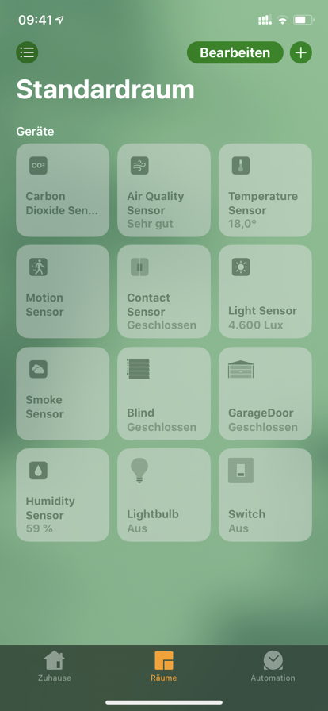

Homebridge-Logo-TS
==================



Use a Siemens LOGO! PLC for switch on whatever you want.  
Communicate with LOGO! 8.SF4 over Modbus and with LOGO! 0BA7 / 0BA8 over Snap7.  

Type of Accessory:
- Switch
- Blind
- Garage Door
- Lightbulb

Type of Sensor Accessory:
- Light Sensor
- Motion Sensor
- Contact Sensor
- Temperature Sensor
- Humidity Sensor
- Carbon Dioxide Sensor
- Air Quality Sensor  


The plugin that this one is based on: [homebridge-tesla](https://github.com/nfarina/homebridge-tesla).  
If you use Homebridge-Logo-TS please donate: [PayPal.Me/Sinclair81](https://www.PayPal.Me/Sinclair81) !!  


## Beta Test
1. Download or clone Homebridge-Logo-TS.
2. Install: $ npm install
3. Build:   $ npm run build
4. Run:     $ /usr/local/bin/homebridge -D -P ~/Homebridge-Logo-TS/

<!--## Installation

1. Install homebridge using: `sudo npm install -g --unsafe-perm homebridge`
2. Install homebridge-config-ui-x using: `sudo npm install -g --unsafe-perm homebridge-config-ui-x`
3. Update your configuration file with this guide: https://smartapfel.de/homebridge/plugins-installieren/
4. Install homebridge-logo-ts using: homebridge-config-ui-x's Webserver
5. Update your configuration file with code like the sample below -->

Homebridge-Logo-TS configuration parameters

Name                     | Value               | Required | Option for | Notes
------------------------ | ------------------- | -------- | ---------- | ------------------------
`accessory`              | "Logo-TS"           | yes      | all        | Must be set to "Logo-TS".
`name`                   | (custom)            | yes      | all        | Name of accessory that will appear in homekit app.
`interface`              | "modbus" or "snap7" | yes      | all        | Communication, depends on LOGO! type, 8.SF4 Modbus or Snap7, 0BA7 / 0BA8 only Snap7.
`ip`                     | "10.0.0.100"        | yes      | all        | Must be set to the IP of your LOGO! PLC.
`port`                   | 505                 | no       | "modbus"   | Must be set to the Modbus Port of your LOGO! PLC, default is: 505.
`logoType`               | "8.SF4"             | no       | "snap7"    | Must be set to the type of your LOGO! PLC, default is: "8.SF4".
`localTSAP`              | "0x1200"            | no       | "snap7"    | Must be set to the localTSAP of your LOGO! PLC, default is: 0x1200.
`remoteTSAP`             | "0x2200"            | no       | "snap7"    | Must be set to the remoteTSAP of your LOGO! PLC, default is: 0x2200.
`type`                   | "switch" or ...     | yes      | all        | Type of Accessory: "switch", "blind", "garagedoor", "lightbulb" or Type of Sensor Accessory: "lightSensor", "motionSensor", "contactSensor", "temperatureSensor", "humiditySensor", "carbonDioxideSensor", "airQualitySensor"
`updateInterval`         | 0                   | no       | all        | Auto Update Interval in milliseconds, 0 = Off
`buttonValue`            | 1                   | no       | all        | Value for Digital Button
`pushButton`             | 1                   | no       | all        | If e.g. the network input in the LOGO! a hardware button on the LOGO! simulated.
`debugMsgLog`            | 0                   | no       | all        | 1 - Displays messages of accessories in the log.
`switchGet`              | "Q1"                | no       | "switch"   | Switch Get - Qn, Mn or Vn.n
`switchSetOn`            | "V2.0"              | no       | "switch"   | Switch Set On - Mn or Vn.n
`switchSetOff`           | "V3.0"              | no       | "switch"   | Switch Set Off - Mn or Vn.n
`blindSetPos`            | "VW50"              | no       | "blind"    | Blind Set Pos - AMn or VWn - (Analog Control)
`blindGetPos`            | "VW52"              | no       | "blind"    | Blind Get Pos - AMn or VWn - (Analog Control)
`blindSetState`          | "VW54"              | no       | "blind"    | Blind Get State - AMn or VWn - (Analog Control)
`blindDigital`           | 0                   | no       | "blind"    | 0 for Analog Control, 1 for Button Control
`blindSetUp`             | "V5.0"              | no       | "blind"    | Blind Set Up - Mn or Vn.n - (Button Control)
`blindSetDown`           | "V5.1"              | no       | "blind"    | Blind Set Down - Mn or Vn.n - (Button Control)
`blindGetUpDown`         | "V5.2"              | no       | "blind"    | Blind Up or Down - Return 1 for Up or 0 for Down - (Button Control)
`garagedoorOpen`         | "V6.0"              | no       | "garagedoor" | Garagedoor Open - Mn or Vn.n
`garagedoorClose`        | "V6.1"              | no       | "garagedoor" | Garagedoor Close - Mn or Vn.n
`garagedoorState`        | "V6.2"              | no       | "garagedoor" | Garagedoor State - Mn or Vn.n
`lightbulbSetOn`         | "V7.0"              | no       | "lightbulb" | Lightbulb Set On - Mn or Vn.n
`lightbulbSetOff`        | "V7.1"              | no       | "lightbulb" | Lightbulb Set Off - Mn or Vn.n
`lightbulbSetBrightness` | "VW70"              | no       | "lightbulb" | Lightbulb Set Brightness - AMn or VWn
`lightbulbGetBrightness` | "VW72"              | no       | "lightbulb" | Lightbulb Get Brightness - AMn or VWn
`lightLevel`             | "AM3"               | no       | "lightSensor"         | Light Sensor for Current Ambient Light Level in Lux
`motionDetected`         | "M9"                | no       | "motionSensor"        | Motion Sensor
`contactDetected`        | "M15"               | no       | "contactSensor"       | Contact Sensor
`temperature`            | "AM2"               | no       | "temperatureSensor"   | Temperature Sensor for Current Temperature in °C
`humidity`               | "AM1"               | no       | "humiditySensor"      | Humidity Sensor for Current Relative Humidity in %
`carbonDioxideLevel`     | "AM3"               | no       | "carbonDioxideSensor" | Carbon Dioxide Sensor for Carbon Dioxide Level in ppm
`carbonDioxideLimit`     | 1000                | no       | "carbonDioxideSensor" | Carbon Dioxide Sensor for Carbon Dioxide Peak Level in ppm
`carbonDioxideLevel`     | "AM3"               | no       | "airQualitySensor"    | Air Quality Sensor for Air Quality (Carbon Dioxide Level in ppm)


## Configuration

```
"accessories": [
    {
        "accessory": "Logo-TS",
        "name": "Switch ModBus",
        "interface": "modbus",
        "ip": "10.0.0.100",
        "port": 505,
        "type": "switch",
        "switchGet": "Q1",
        "switchSetOn": "V2.0",
        "switchSetOff": "V3.0"
    },
    {
        "accessory": "Logo-TS",
        "name": "Switch Snap7",
        "interface": "snap7",
        "ip": "10.0.0.200",
        "logoType": "0BA7",
        "localTSAP": "0x1200",
        "remoteTSAP": "0x2200",
        "type": "switch",
        "switchGet": "Q2",
        "switchSetOn": "V2.1",
        "switchSetOff": "V3.1"
    },
    {
        "accessory": "Logo-TS",
        "name": "Blind ModBus Analog",
        "interface": "modbus",
        "ip": "10.0.0.100",
        "port": 505,
        "type": "blind",
        "blindSetPos": "VW50",
        "blindGetPos": "VW52",
        "blindGetState": "VW54"
    },
    {
        "accessory": "Logo-TS",
        "name": "Blind Snap7 Analog",
        "interface": "snap7",
        "ip": "10.0.0.200",
        "logoType": "0BA7",
        "localTSAP": "0x1200",
        "remoteTSAP": "0x2200",
        "type": "blind",
        "blindSetPos": "VW50",
        "blindGetPos": "VW52",
        "blindGetState": "VW54"
    },
    {
        "accessory": "Logo-TS",
        "name": "Blind ModBus Digital",
        "interface": "modbus",
        "ip": "10.0.0.100",
        "port": 505,
        "type": "blind",
        "blindDigital": 1,
        "blindSetUp": "V5.0",
        "blindSetDown": "V5.1",
        "blindGetUpDown": "V5.2"
    },
    {
        "accessory": "Logo-TS",
        "name": "Blind Snap7 Digital",
        "interface": "snap7",
        "ip": "10.0.0.200",
        "logoType": "0BA7",
        "localTSAP": "0x1200",
        "remoteTSAP": "0x2200",
        "type": "blind",
        "blindDigital": 1,
        "blindSetUp": "V5.0",
        "blindSetDown": "V5.1",
        "blindGetUpDown": "V5.2"
    },
    {
        "accessory": "Logo-TS",
        "name": "GarageDoor ModBus",
        "interface": "modbus",
        "ip": "10.0.0.100",
        "port": 505,
        "updateInterval": 120000,
        "type": "garagedoor",
        "garagedoorOpen": "V6.0",
        "garagedoorClose": "V6.1",
        "garagedoorState": "V6.2"
    },
    {
        "accessory": "Logo-TS",
        "name": "GarageDoor Snap7",
        "interface": "snap7",
        "ip": "10.0.0.200",
        "logoType": "0BA7",
        "localTSAP": "0x1200",
        "remoteTSAP": "0x2200",
        "updateInterval": 120000,
        "type": "garagedoor",
        "garagedoorOpen": "V6.0",
        "garagedoorClose": "V6.1",
        "garagedoorState": "V6.2"
    },
    {
        "accessory": "Logo-TS",
        "name": "Lightbulb ModBus",
        "interface": "modbus",
        "ip": "10.0.0.100",
        "port": 505,
        "type": "lightbulb",
        "lightbulbSetOn": "V7.0",
        "lightbulbSetOff": "V7.1",
        "lightbulbSetBrightness": "VW70",
        "lightbulbGetBrightness": "VW72"
    },
    {
        "accessory": "Logo-TS",
        "name": "Lightbulb Snap7",
        "interface": "snap7",
        "ip": "10.0.0.200",
        "logoType": "0BA7",
        "localTSAP": "0x1200",
        "remoteTSAP": "0x2200",
        "type": "lightbulb",
        "lightbulbSetOn": "V7.0",
        "lightbulbSetOff": "V7.1",
        "lightbulbSetBrightness": "VW70",
        "lightbulbGetBrightness": "VW72"
    },
    {
        "accessory": "Logo-TS",
        "name": "Light Sensor",
        "interface": "snap7",
        "ip": "10.0.0.200",
        "logoType": "0BA7",
        "localTSAP": "0x1200",
        "remoteTSAP": "0x2200",
        "updateInterval": 30000,
        "debugMsgLog": 1,
        "type": "lightSensor",
        "lightLevel": "AM3"
    },
    {
        "accessory": "Logo-TS",
        "name": "Motion Sensor",
        "interface": "snap7",
        "ip": "10.0.0.200",
        "logoType": "0BA7",
        "localTSAP": "0x1200",
        "remoteTSAP": "0x2200",
        "updateInterval": 30000,
        "debugMsgLog": 1,
        "type": "motionSensor",
        "motionDetected": "M9"
    },
    {
        "accessory": "Logo-TS",
        "name": "Contact Sensor",
        "interface": "modbus",
        "ip": "10.0.0.100",
        "port": 505,
        "updateInterval": 30000,
        "debugMsgLog": 1,
        "type": "contactSensor",
        "contactDetected": "M15"
    },
    {
        "accessory": "Logo-TS",
        "name": "Temperature Sensor",
        "interface": "modbus",
        "ip": "10.0.0.100",
        "port": 505,
        "updateInterval": 30000,
        "debugMsgLog": 1,
        "type": "temperatureSensor",
        "temperature": "AM2"
    },
    {
        "accessory": "Logo-TS",
        "name": "Humidity Sensor",
        "interface": "modbus",
        "ip": "10.0.0.100",
        "port": 505,
        "updateInterval": 30000,
        "debugMsgLog": 1,
        "type": "humiditySensor",
        "humidity": "AM1"
    },
    {
        "accessory": "Logo-TS",
        "name": "Carbon Dioxide Sensor",
        "interface": "modbus",
        "ip": "10.0.0.100",
        "port": 505,
        "updateInterval": 30000,
        "debugMsgLog": 1,
        "type": "carbonDioxideSensor",
        "carbonDioxideLevel": "AM3",
        "carbonDioxideLimit": 1000
    },
    {
        "accessory": "Logo-TS",
        "name": "Air Quality Sensor",
        "interface": "modbus",
        "ip": "10.0.0.100",
        "port": 505,
        "updateInterval": 30000,
        "debugMsgLog": 1,
        "type": "airQualitySensor",
        "carbonDioxideLevel": "AM3"
    }
]
```
